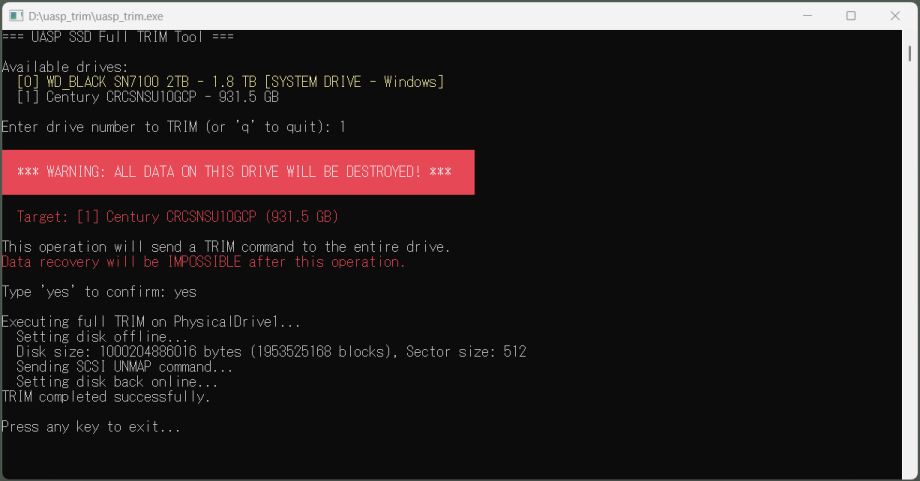

# UASP SSD Full TRIM(SCSI UNMAP) Tool for Windows

[English README is available here](README.en.md)

UASP（USB Attached SCSI Protocol）経由で接続されたUSB外付けSSDに対して、全域TRIMコマンド（SCSI UNMAP）を発行するWindows用ツールです。

## 概要

本ツールはSSD全域を対象としたSCSI UNMAPコマンドを、**UASP対応のUSB-SSD変換アダプタ経由**で直接発行することで、簡易的なSSDの"リセット"を行う目的のものです。

パフォーマンスが悪化したSSDの速度回復や、厳重な秘匿が必要なデータが入っていないSSDの廃棄準備などに使えると思います。

## 警告

このツールはディスク全体にTRIMを発行します。**実行後のデータ復旧は通常のツールでは不可能です。**

使用前に以下を確認してください：
- 対象ドライブのデータが不要であること
- 正しいドライブを選択していること
- 重要なデータのバックアップが完了していること

**完全なデータ消去ツールではありません**が、現在のSSDではTRIMコマンドを発行した領域のデータ復旧の難易度は高いので、簡易的な消去ツールとしても利用できます。

## 動作要件

- Windows 10/11
- 管理者権限
- UASP対応のUSB-SSD変換アダプタ

## 使用方法

1. `uasp_trim.exe` を実行
2. 表示されるドライブ一覧から対象のドライブ番号を入力
3. 確認プロンプトで `yes` と入力して実行

## 制約

- UASP経由のSSD限定で使用できます。内蔵SSD(M.2やSATA直結)は別のツールを使ってください。
- 何かファイルを開いていたりエクスプローラで中を見ていたりするドライブに対してTRIMを実行した場合、何かおかしなことが起きるかもしれません。
- 本当はSecure Erase相当のことを行いたいのですが、UASPのブリッジチップでは対応していないことが多いらしく、とりあえず全域TRIMでお茶を濁すことにしました。

## ビルド方法

新しめのVisual Studioをインストールした状態で、build.batを実行してください。

## 技術詳細

- SCSI UNMAP（opcode 0x42）コマンドを使用
- IOCTL_SCSI_PASS_THROUGH_DIRECT経由で発行
- ボリュームのロック・ディスマウントを自動実行
- ディスクをオフラインに設定してから実行

Claude CodeによるVibe Coding後に、作者による手持ちSSDでの動作確認とコード確認を行っています。

## ライセンス

Unlicense - パブリックドメイン。
